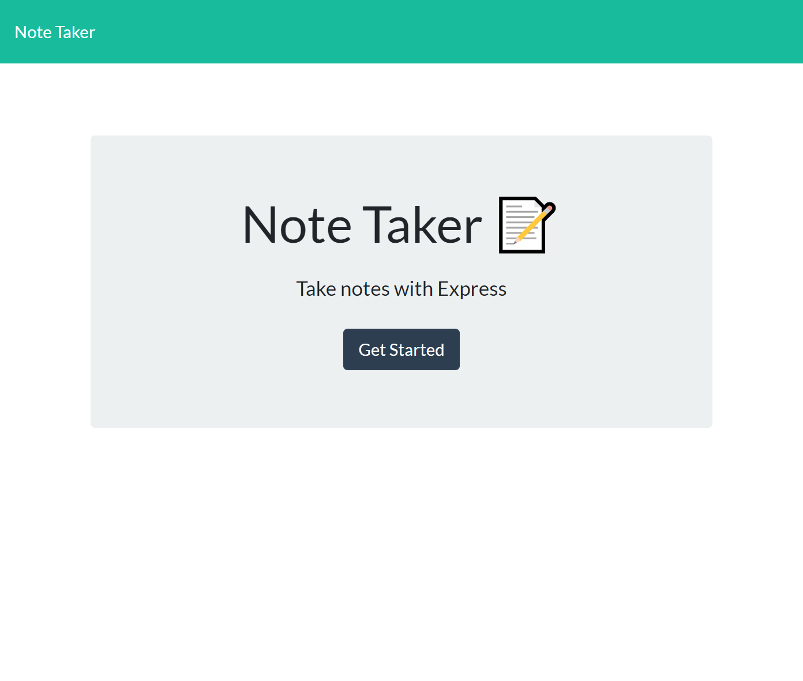
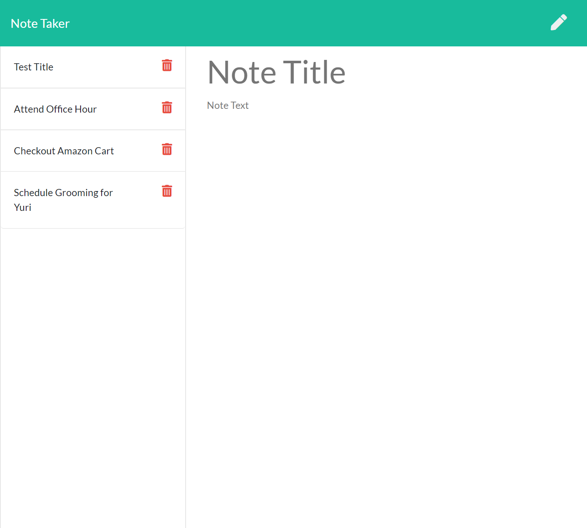

# Mobile Notes
Mobile Notes is a note taker application that let users save and delete quick notes. User is able to input note title and description on the right side of the page and save their notes by pressing the save icon near the right top corner. Saved notes are appended on the left side and users are able to delete them as well. Don't hesitate to try it out!

#### This page is licensed under (click badge for license page): 

## Built With
* HTML
* CSS
* JavaScript
* Bootstrap 
* Express.js
* Heroku
* Npm Packages - fs, path, express

## Table of Contents
* [Installation](#installation)
* [Usage](#usage)
* [Contributors](#contributors)
* [License](#license) 
* [Contributing](#contributing) 
* [Contact](#contact)

## Installation
`git clone https://github.com/kcheykim/note-taker.git` 
`npm init -y` 
`npm i express` 

## Usage
Link to Application:  
https:
 

## Contributors
Ricky Leung

## License
Notice: This license is covered under (https://opensource.org/licenses/MIT)

## Contributing

## Contact  
GitHub: http://github.com/ricky0320
Email: ricxx0320@gmail.com
